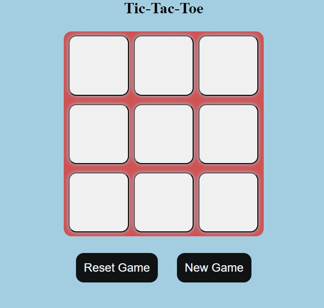
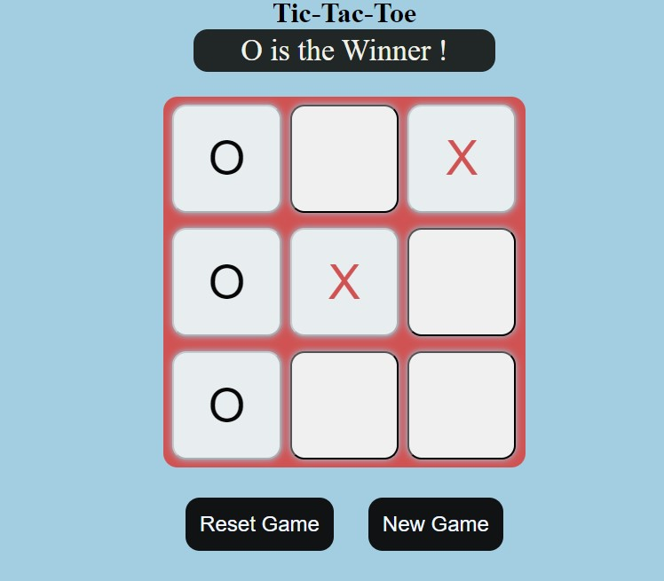

# Tic-Tac-Toe Game 🎮

A simple, interactive **Tic-Tac-Toe Game** built using **HTML**, **CSS**, and **JavaScript**. Play the classic game against a friend, with smooth functionality and user-friendly design.

---

## Features 

- 🎲 **Reset Game**: Reset the game at any point and start over.
- 🏆 **New Game**: starts a new game after a winner is declared by clicking new game button.
- ❌⭕ **Prevent Invalid Moves**: Once a cell is clicked, its value cannot be changed.
- 🖌️ **Responsive Design**: Fully responsive layout that works on all screen sizes.
- 🎉 **Winner Announcement**: Displays the winner or declares a draw when the game ends.

---

## Technologies Used

- **HTML**: Structure of the game.
- **CSS**: Styling the game board and enhancing visual appeal.
- **JavaScript**: Logic to handle game flow, clicks, reset, and winner detection.

---

## How to Play?

1. Open the game in your browser.
2. Player 1 (O) and Player 2 (X) take turns clicking on the empty cells.
3. The first player to align **three symbols** in a row (horizontal, vertical, or diagonal) wins.
4. Use the **"Reset" button** to restart the game at any time.

---

## Screenshots 

### Game Board

This is a screenshot of Tic Tac Toe Board initially

### Player Wins

This is a screenshot of Tic Tac Toe Board when player wins

---

## Project Setup 

1. Clone the repository:

git clone https://github.com/Prarthanaa-G/Tic-Tac-Toe-Game.git

2.Navigate to the project directory:

bash
Copy code

cd tic-tac-toe-game

3.Open index.html in any browser.

## Contact ##
If you have any questions or suggestions, feel free to reach out:

Email: prarthanamurthy29@gmail.com

